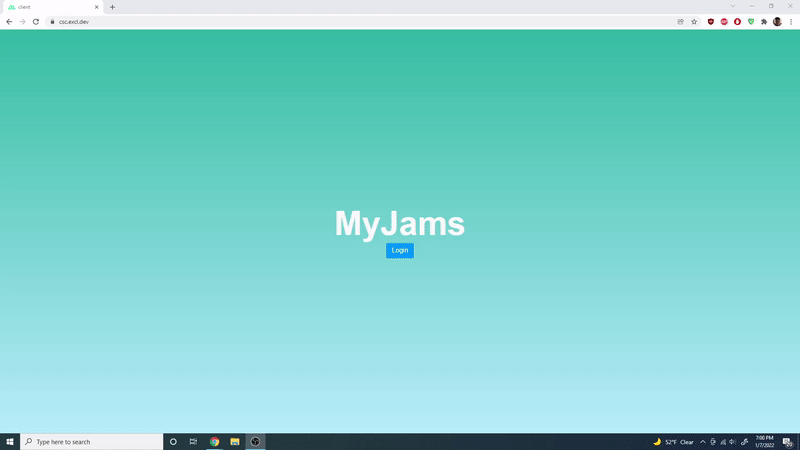
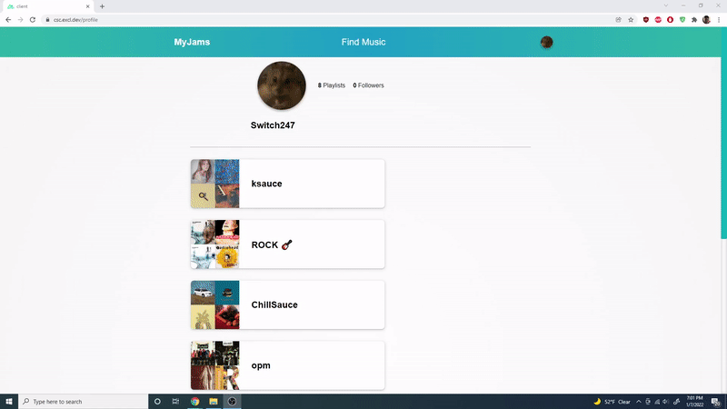
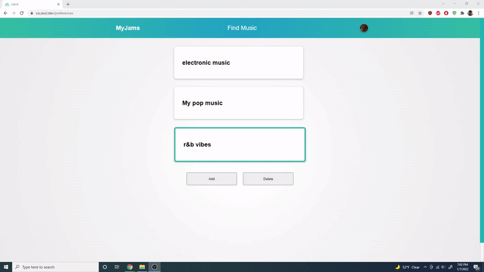
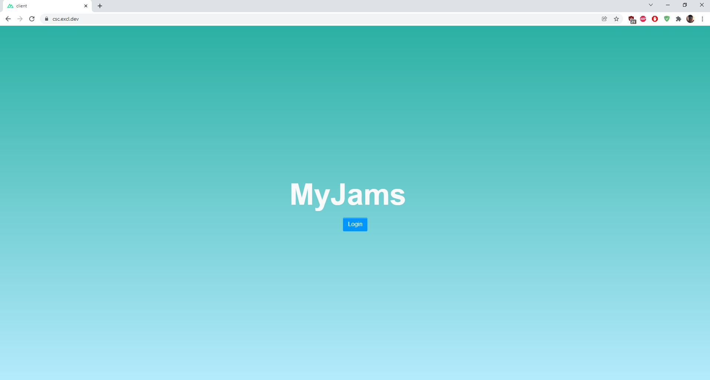
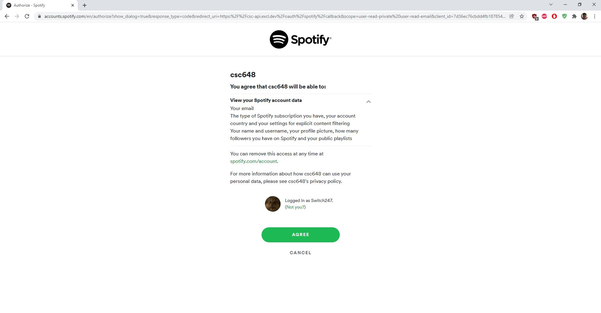
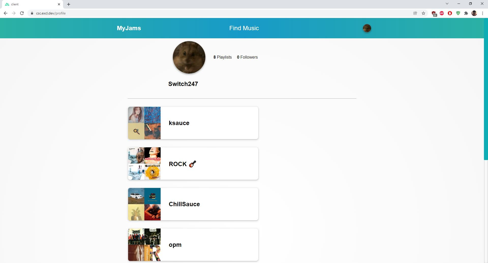
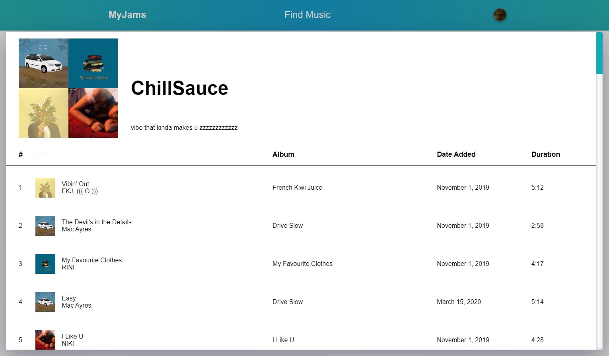
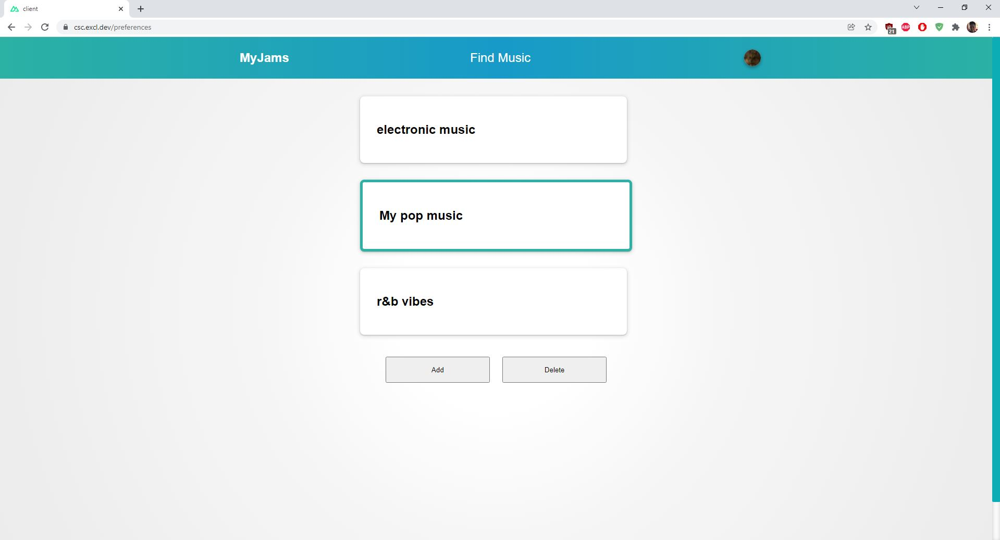
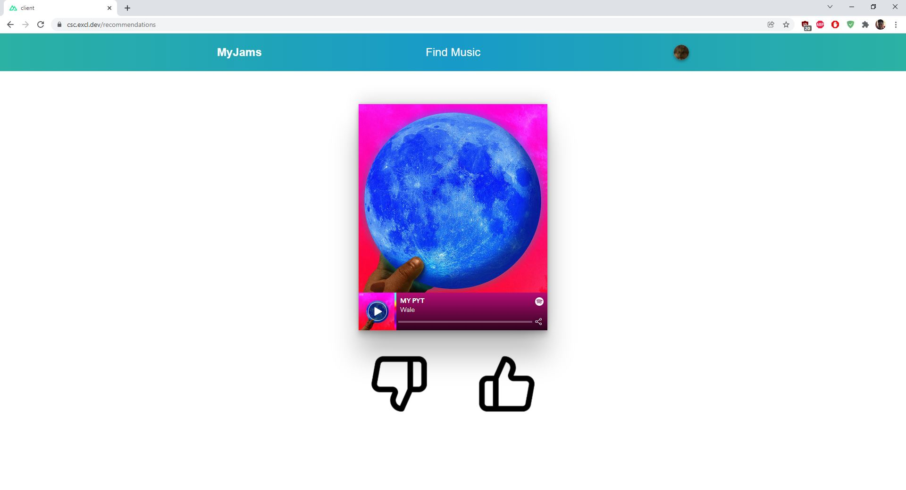

<h2 align="center">MyJams</h2>

SFSU FA2021 Software Engineering Project

### What is MyJams?

**MyJams is a web application designed to recommend music to Spotify users**

- Users can **login** via their Spotify account
- Users can **view** their Spotify playlists
- Users can **receive song recommendations** based on their preferences

## How does it work?

<h3 align="center">Logging in</h3>

  

Users will need to have a Spotify account prior to logging into the application. MyJams uses Spotify OAuth in order to receive access to the users' Spotify data. 

<h3 align="center">Setting preferences</h3>

  

From there, users will need to set their "preferences" which tells the application the genre of music to recommend the user as well as specific song attributes to look for such as **popularity, energy level, and acousticness**

<h3 align="center">Recommendations</h3>

  

MyJams relies on the Spotify API's recommendation endpoint in order to gather song recommendations for the user. The application recommends songs in batches of 10. Everytime the user successfully goes through 10 songs, MyJams takes the user's choices and sends the data to the backend server where the current preference's song attributes (popularity, energy level, and acousticness) are adjusted to match the user's feedback. This means that the next batch of 10 recommended songs will reflect the users' most recent likes and dislikes.

Users can swipe left and right to dislike and like songs. Users also have the option of clicking on the thumbs down and thumbs up icons to signal their feedback.

<h3 align="center">Profile</h3>

  

Users can also view their public Spotify playlists and songs through MyJams.

## Screenshots

<h3 align="center">Login Page</h3>

  

<h3 align="center">Spotify OAuth</h3>

  

<h3 align="center">Profile Page</h3>

  

<h3 align="center">Playlist</h3>

  

<h3 align="center">Preferences Page</h3>

  

<h3 align="center">Recommendations Page</h3>

  

<h3 align="center">Built using Nuxtjs, Expressjs and MongoDB<h3>
README.MD credits to : stephenjusto247
